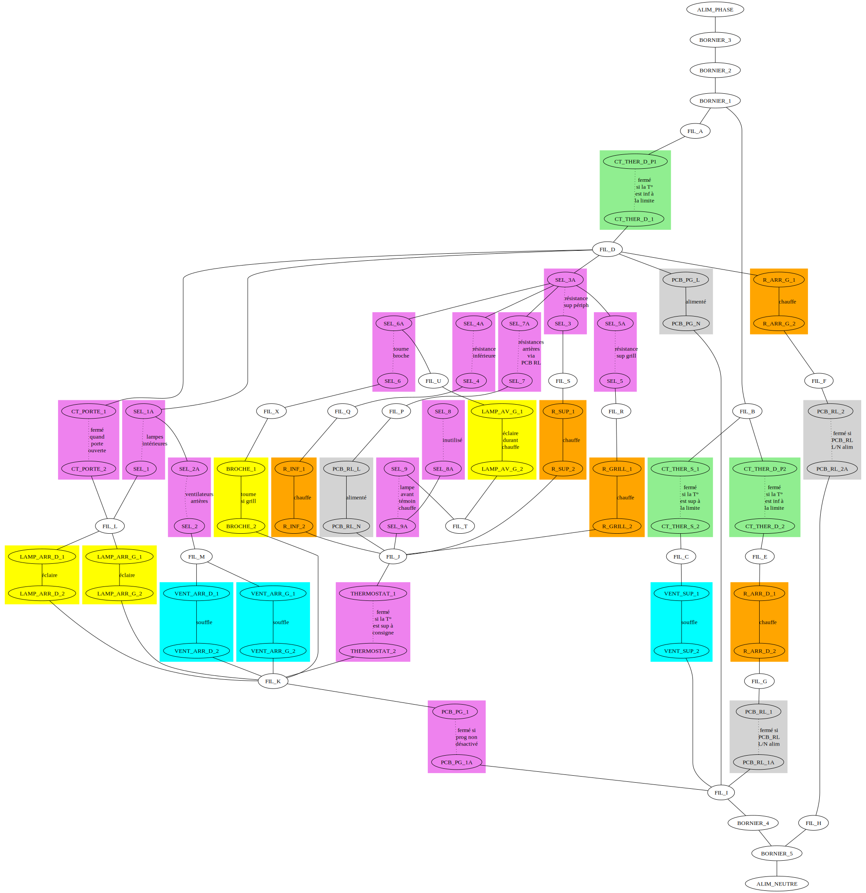
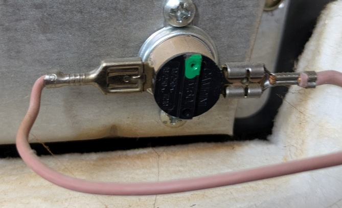

# Câblage piano-four Smeg CG90IX

Manuel [en français](documents/cg90ix-manual.pdf)

Diagramme de la [vue éclatée](documents/cg90ix-eclate.pdf)

Vue d'ensemble arrière

Arrivée et raccordements électrique généraux

## Schémas électriques

Sécurisation à la terre

Fonctionnement du four et de ses accessoire

Fonctionnement des plaques induction (**INFO**: non étudié, car pas eu besoin de m'y intéresser jusqu'ici)

## Composants

- **WARNING**
  - une cosse femelle d'un fil "associé au neutre" est flottante dans l'espace supérieur
  - elle est isolée par une cosse plastique, donc aucun risque en termes de sécurité
  - elle semble inutilisée et est rangée sur l'isolant du côté "moteur broche"

- Prise de liaison entre l'arrière et l'espace supérieur
  - connecteur type "molex" à 15 broches **avec** détrompeur
  - Vue arrière

    

  - Relevé de câblage

    

- Contacteur de porte [Rold VRU Ovens](documents/rold-VRU-Ovens.pdf)
  - fonctionnement attendu : porte ouverte = contact fermé / porte fermée = contact ouvert
    - installation et sens

      

    - référence

      

- Sécurité
  - [campini TY 62](documents/campini-TY-62.pdf)
    - double contact thermique bi-métalique, 4 contacts

      

  - [campini TY 60](documents/campini-TY-60.pdf)
    - simple contact thermique bi-métalique, 2 contacts

      

- Thermostat
  - [campini TY 95](documents/campini-TY-95.pdf) : thermostat réglable, 2 contacts + sonde température
  - ne s'active que si la température mesurée est inférieure à la consigne
  - en position "zéro", coupe le circuit de chauffe, quel que soit le mode
  - vue arrière, installé

    

- Sélecteur de mode

  - contact 9 poles et tambour inférieur "sur mesure"
    - Vue recto, avec platines de liaisons entre différentes sorties

      

    - Vue verso, avec tambour spécialisé

      

  - Modes de fonctionnement

    - positions du sélecteur (incrémenté en sens horaire, 0 = arrêt à vericale haute)
      - **P0** : arrêt complet (conso 8W en permanence)
      - **P1** : lampes seules (conso < 50W)
      - **P2** : résistances haut (sans grill) et résistance bas (conso totale 12.7 ampères)
      - **P3** : résistance grill seul (conso totale 11.1 ampères)
      - **P4** : résistance grill seul et ventilation arrière (conso totale 11.5 ampères)
      - **P5** : résistance bas et ventilation arrière (conso totale 7.8 ampères)
      - **P6** : résistances et ventilation arrière (conso totale 16.5 ampères)

    - contacts activé selon position
      - **C1** : lampes intérieures
      - **C2** : ventilation arrière droite et gauche
      - **C3** : résistance supérieure périphérique
      - **C4** : résistance inférieure
      - **C5** : résistance supérieure grill
      - **C6** : tourne broche
      - **C7** : résistances arrière droite et gauche (activées via carte relais `PCB RL`)
      - **C8** : inutilisé
      - **C9** : lampe avant (témoin chauffe)

  - Table de vérité **du tambour** sens **horaire**
    - **IMPORTANT** : **sans** tenir compte
      - des platines reliées entre elles
      - du câblage externe éventuel
    - Etat du contact
      - `O` = contact ouvert
      - `F` = contact fermé

    |     | C1  | C2  | C3  | C4  | C5  | C6  | C7  | C8  | C9  |
    | --- | --- | --- | --- | --- | --- | --- | --- | --- | --- |
    | P0  | O   | O   | O   | O   | O   | O   | O   | O   | O   |
    | P1  | F   | O   | O   | O   | O   | O   | O   | F   | O   |
    | P2  | F   | O   | F   | F   | O   | O   | O   | F   | F   |
    | P3  | F   | O   | O   | O   | F   | F   | O   | F   | F   |
    | P4  | F   | F   | O   | O   | F   | F   | O   | F   | F   |
    | P5  | F   | F   | O   | F   | O   | O   | O   | F   | F   |
    | P6  | F   | F   | O   | O   | O   | O   | F   | F   | F   |

- Résistancess de chauffe 230 volts
  - Résistances supérieures

    

    - périphérique
      - 40 ohm et ~5.5 ampères
      - bornes extérieures du lot de 5 bornes
    - grill (zig-zag)
      - 19 ohm et ~11.3 ampères
      - bornes intérieurs du lot de 5 bornes
    - terre : borne centrale

  - Résistance inférieure
    - 30 ohm et ~7.2 ampères
    - au centre en bas sur la vue arrière générale

  - Arrière gauche et droite
    - 26 ohm (chacune) et ~8.5 ampères (chacune)
    - Résistance et ventilation arrière gauche (vue arrière)

      

    - Résistance et ventilation arrière droit  (vue arrière)

      

- Ventilateurs
  - Arrière (chacun pour chaleur tournante)
    - pas de référence relevée
    - 54 ohm chacun, 25W chacun
    - voir photos des résistances arrière

  - Supérieur "tonneau" entre four/plaques : 116 ohm, 25W
    - Pour le refroidissement après arrêt du four ?

      

    - Vue de l'espace intérieur entre le four et les plaques, côté des plaques

      

    - Vue de l'espace intérieur entre le four et les plaques, côté des éléments du four

      

- Lampes
  - intérieures
    - support : google "Oven Lamp LH500 NOVA"
    - ampoule : à filament, 25W maximum
    - Lampe intérieure gauche (vue arrière)

      

    - Lampe intérieure droite (vue arrière)

      

  - témoin d'alimentation des résistances
    - ampoule : intégrée filament mini, 230V

- Tourne broche
  - pas de référence relevée
  - INFO : fonctionne automatiquement dans n'importe quel mode "grill"
  - **WARNING** : au bout de quelques années, fait un bruit du tonnerre : comme pas utilisé, débranché
  - **WARNING** : fil d'alimentation de la rotissoir abîmé (à l'assemblage ? avec la chaleur ?)

    

- Carte électronique "Relais chauffe arrière"
  - Vue d'ensemble en situation

    

  - la tension secteur est convertie à l'allumage en tension BT DC (12V ?) via un "capacitor dropper"
  - dès l'allumage, les relais des deux élément de chauffe arrière sont activés, terminant le circuit ?
  - Vue du recto

    

  - Vue du verso

    

- Carte électronique "Programmateur / horloge"

  - Vue recto

    

  - Vue verso

    

  - Raccordement

    

  - Cosses coudées inversées ... (côté relais = pas une bonne idée, car moins de surface de contact ?)

    

  - achat
    - https://www.adepem.com/dpm128557/programmateur-5-touches-816292759
    - https://www.pieces-tout-electromenager.com/horloge/15022-horloge-programmateur-four-cuisiniere-smeg.html

  - forum
    - https://forum.adepem.com/t/programmateur-four-smeg-cg90/9037
    - https://forum.adepem.com/t/installation-nouveau-programmateur-smeg-cg90x/6766
    - https://forum.adepem.com/t/branchement-nouveau-programmateur-piano-smeg-cg90x/5483

  - fonctionnement
    - la puissance passe par le relais du minuteur pour tous les modes hors "arrière + ventilation"
    - la commande des relais arrière passe par le minuteur pour le mode "arrière + ventilation"

  - entretien
    - les contacts et les fils du relais chauffent (hors "arrière + ventilation")
    - surveiller leur état, et si besoin remplacer les fils 2.5mm² et les cosses pour un bon contact

  - astuce
    - activer le mode "lumière" pour vérifier que le four est "autorisé" (icone "chauffe")
    - en situation normale, le point doit être fixe, et l'icone "chauffe" allumée
    - en cas de panne et de non usage du programmateur
      - bypasser le relais en connectant les cosses **de sortie** ensembles
      - **s'assurer d'une excellente connectivité**
        - entre les conducteurs d'origine (ou rénovés)
        - s'assurer que les contacts sont propres et non oxydés
        - s'assurer que les brins du conducteurs ne sont pas chauffés ni oxydés
        - sinon rénover le câblage concerné, car **plus de 3 kW transite par ces fils et connecteurs**
        - la puissance de tous les modes (hors "chaleur par l'arrière") passe par là :

## Utilisation du programmateur-horloge

Réglage heure

- presser "chauffe+nochauffe", et relâcher, le point central clignotte
- pendant qu'il clignotte, presser/maintenir + ou - pour régler, puis attendre le point fixe

Durée de chauffe

- pour configurer
  - presse "chauffe"
  - une durée initale de 0:00 apparaît
  - régler avec +/-
  - attendre la sortie du mode (retour à l'horloge)
- pour annuler
  - presser "chauffe" (on voit la durée restante)
  - revenir à 0:00 avec -
  - le bip retentit **et** "chauffe" s'éteint **et** le four est **désactivé**
  - presser sur "chauffe+nochauffe" pour réactiver le four, l'icône "chauffe" s'allume à nouveau

Heure de fin de chauffe

- pour configurer
  - presse "nochauffe"
  - l'heure positionnée à l'heure actuelle apparaît
  - régler avec +/-
  - attendre la sortie du mode (retour à l'heure actuelle)
- pour annuler
  - presser "nochauffe" (on voir l'heure de fin prévue)
  - revenir à l'heure actuelle avec
  - le bip retentit **et** "chauffe" s'éteint **et** le four est **désactivé**
  - presser sur "chauffe+nochauffe" pour réactiver le four, l'icône "chauffe" s'allume à nouveau

Minuteur "sonnerie uniquement"

- pour configurer
  - presse "cloche"
  - une durée initale de 0:00 apparaît
  - régler avec +/-
  - attendre la sortie du mode (retour à l'horloge) et affichage de l'icône "cloche"
- pour annuler
  - presser "cloche" (on voit la durée restante)
  - revenir à 0:00 avec -
  - le bip retentit **en laissant le four activé**
  - presser simultanément sur "+" et "-" pour désactiver le minuteur
